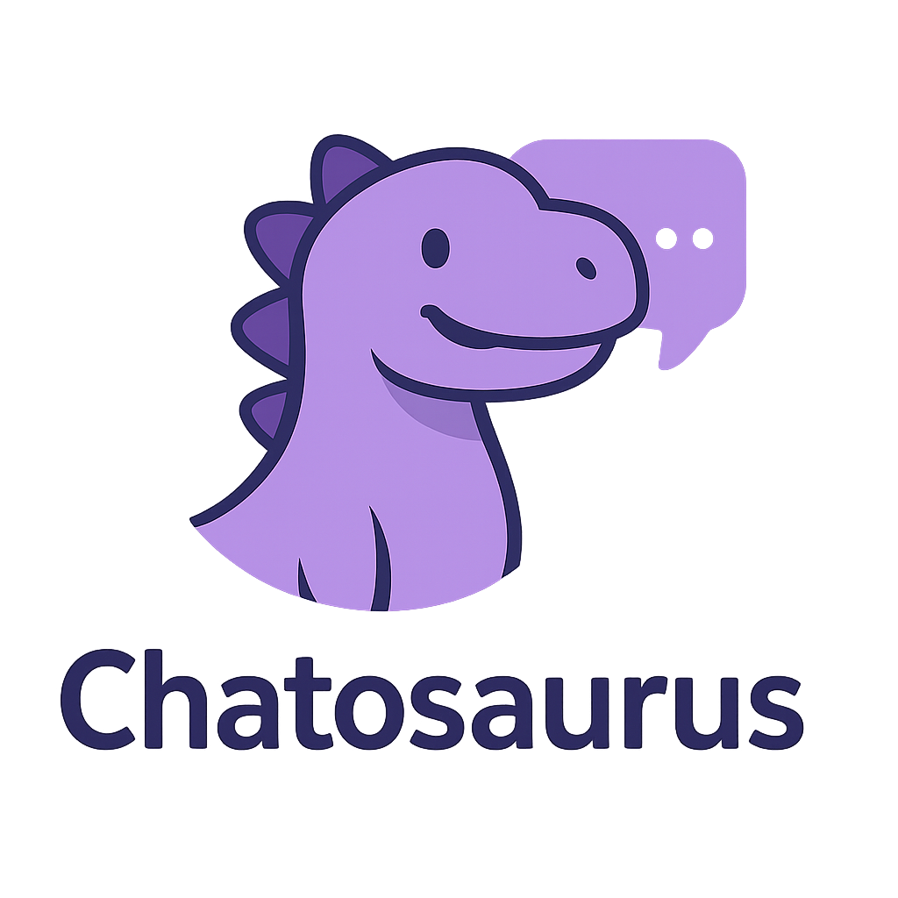

  

  

    Chatosaurus is an AI assistant plugin for Docusaurus that brings your docs to life with conversational search. Powered by retrieval-augmented generation, it lets users interact with your documentation like they're chatting with a brainy, violet-scaled dev dino.
  

---

## ✨ Features

- Seamless integration with Docusaurus.
- Adds a new `/assistant` route with an interactive AI chat.
- Powered by several AI models.
- Context-aware responses based on your docs.

---

## 🤝 Contributing

Pull requests, feature ideas, and bug reports are welcome!

---

## 📝 License

MIT

---

> Built with ❤️ to make docs smarter and more human.